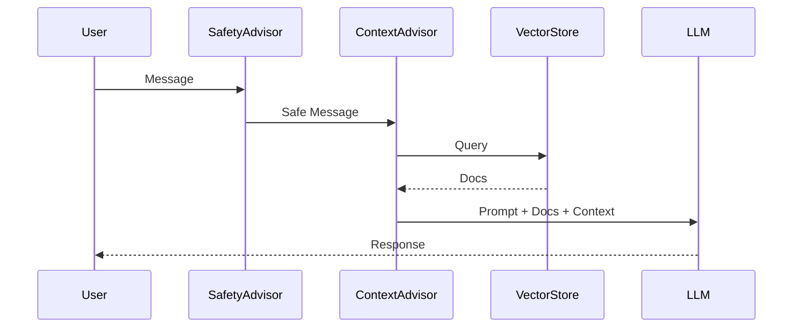

# 🚀 Roadmap to Excellence: Elevating the Spring AI Advisor Project

To transform this project into the **ultimate practical learning medium** for Spring AI and Agentic patterns, we can expand it across four key dimensions: **Functionality**, **Technical Architecture**, **Code Quality**, and **Documentation**.

## 1. Functionality & "Agentic" Capabilities
*Moving from a passive chatbot to an active Agent.*

### A. Tool Calling (Function Calling) vs. Advisors
**Current State:** We use `TicketEscalationAdvisor` to auto-create tickets based on triggers. This is a "rule-based" side effect.
**Improvement:** Implement **Spring AI Tools (`@Tool`)**.
- **What to do:** Give the LLM a `createTicket()` tool function. Let the **LLM decide** when to call it based on the conversation, rather than regex keywords.
- **Learning Value:** Teaches the difference between *interceptors* (Advisors) and *actions* (Tools) – a critical distinction in agent design.

### B. Streaming Responses (`Flux<String>`)
**Current State:** The user waits for the full response (3-5 seconds).
**Improvement:** Implement `StreamChatClient`.
- **Learning Value:** Real-time UX is standard for AI. Shows how to handle reactive streams in Spring Boot + UI.

### C. Multimodal Inputs
**Current State:** Text-only.
**Improvement:** Allow users to upload a screenshot of their error.
- **Learning Value:** Using GPT-4o's vision capabilities. "I see you're getting a 403 error in that screenshot..."

### D. Admin Dashboard
**Current State:** DB access via H2 Console.
**Improvement:** A simple "Agent Portal" where human support staff can:
- View escalated tickets.
- Read the chat transcript associated with the ticket (retrieved from `ConversationSession`).
- "Take over" the chat (Human-in-the-loop).

---

## 2. Technical Architecture & Production Realism
*Moving from "Tutorial/Demo" to "Production-Grade".*

### A. Vector Database: Testcontainers + PostgreSQL (pgvector)
**Current State:** In-memory `SimpleVectorStore`.
**Improvement:** Use **Testcontainers** to spin up a real **PostgreSQL + pgvector** instance for development and tests.
- **Learning Value:** H2 is great for prototypes, but pgvector is the industry standard for open-source RAG. It adds persistence and scalability.

### B. Spring AI Evaluation (The "Unit Tests" of AI)
**Current State:** Manual "Smoke Testing".
**Improvement:** Use **Spring AI Evaluation Framework**.
- **What to do:** Write automated tests that ask: "Does the answer to 'reset password' actually contain the words 'settings' and 'email'?"
- **Learning Value:** Evaluating AI correctness is the hardest part of LLM ops (LLMOps).

### C. Docker & Deployment
**Current State:** Local `mvn spring-boot:run`.
**Improvement:** Create a `Dockerfile` and `docker-compose.yml` (App + DB).
- **Learning Value:** Containerization of AI apps.

---

## 3. Code Standards & Patterns

### A. Structured Output Converters
**Current State:** Metadata is mostly handled manually or via simple advisors.
**Improvement:** Use `BeanOutputConverter` to force the LLM to return strictly formatted JSON for complex queries (e.g., "Extract all dates and prices from this text").

### B. MapStruct for DTOs
**Current State:** Manual getters/setters in Service layer.
**Improvement:** Use **MapStruct** for entity-to-DTO mapping. Reduces boilerplate.

### C. Externalize Prompts
**Current State:** System prompt is a hardcoded String constant in `SupportBotService`.
**Improvement:** Move prompts to `src/main/resources/prompts/system-prompt.st`.
- **Learning Value:** Treating prompts as code/config. Allows non-developers to edit bot personality.

---

## 4. Documentation & Learning Experience

### A. Interactive API Docs (OpenAPI/Swagger)
**Improvement:** Add `springdoc-openapi-starter-webmvc-ui`.
- **Value:** Users can try the API endpoints via a GUI at `/swagger-ui.html`.

### B. "Why This?" Annotations
**Improvement:** Add comments in the code specifically explaining *why* a Spring AI pattern was chosen.
- *Example:* "We use `MessageWindowChatMemory` here because fetching 1000 messages would bankrupt us."

### C. Mermaid Sequence Diagrams
**Improvement:** Add diagrams to the README showing the flow of data through the Advisor chain.

---

## 🏆 The "Best Learning Medium" Strategy

To make this the **#1 Resource** for learning Spring AI, I recommend structuring the repo as a **"Level-Up" Journey**:

1.  **Branch `level-1-basic-chat`**: Just a simple `ChatClient`.
2.  **Branch `level-2-rag`**: Adds Vector Store.
3.  **Branch `level-3-advisors`**: (Current State) Adds Memory, Safety, Context.
4.  **Branch `level-4-agent`**: Adds Tools (Function Calling) & Streaming.
5.  **Branch `level-5-production`**: Docker, Postgres, Eval Tests.

This allows learners to see the **evolution** of the complexity.
