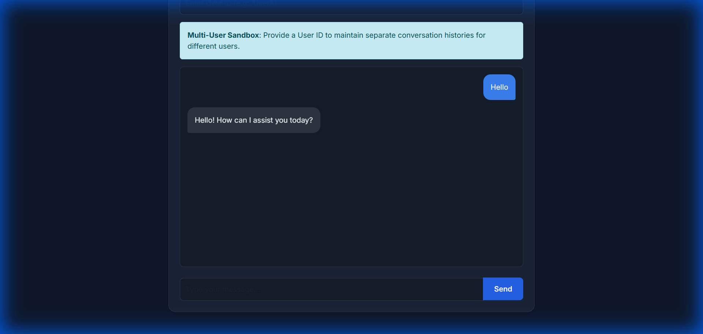
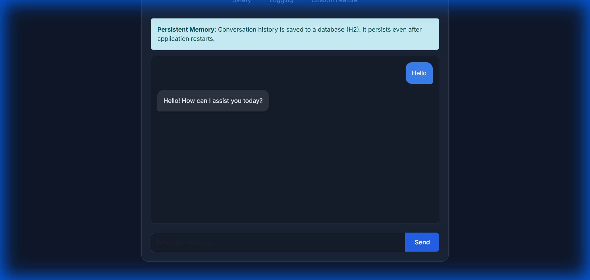

# Spring AI Advisor Application

This project demonstrates various Spring AI features, including memory management, RAG, content safety, and custom advisors.

## Features

| # | Feature | Description |
|---|---|---|
| 1 | **In-Memory** | Conversation history stored in memory |
| 2 | **Multi-User** | Separate histories per `userId` header |
| 3 | **Persistent** | H2 database for history across restarts |
| 4 | **Sliding Window** | Keeps only recent N messages for cost optimization |
| 5 | **RAG** | Uses Mars Colonization Guide for Q&A |
| 6 | **Safety** | `SafeGuardAdvisor` filters harmful content |
| 7 | **Logging** | Custom logging of token usage and duration |
| 8 | **Custom Feature** | Combined RAG + Persistence + Logging + PromptEnhancer |

## Running the Application

```bash
export OPENAI_API_KEY=sk-...
mvn spring-boot:run
```

Access the UI at: `http://localhost:8080/`

## Screenshots

### In-Memory Chat


### Multi-User Sandbox


### Persistent Memory


### Sliding Window


### RAG (Mars Guide)


### Custom Feature (Advisor Chain)


## Endpoints

| Endpoint | Description |
|---|---|
| `/advisor/chat/memory` | In-Memory Bot |
| `/advisor/chat/user` | Multi-User Bot |
| `/advisor/chat/persistent` | Persistent Memory Bot |
| `/advisor/chat/window` | Sliding Window Bot |
| `/advisor/chat/rag` | RAG Bot (Mars Guide) |
| `/advisor/chat/safety` | Safety Advisor Bot |
| `/advisor/chat/logging` | Logging Advisor Bot |
| `/advisor/chat/custom-feature` | Combined Feature Bot |

## Custom Advisors

### PromptEnhancerAdvisor (Spring AOP)
Automatically appends "Please format your response with clear bullet points" to all prompts in the Custom Feature endpoint.

### Custom Logging
Logs token usage to console:
```
Custom Advisor Log - Tokens: [Prompt: 10, Gen: 20, Total: 30], Duration: 150ms
```
