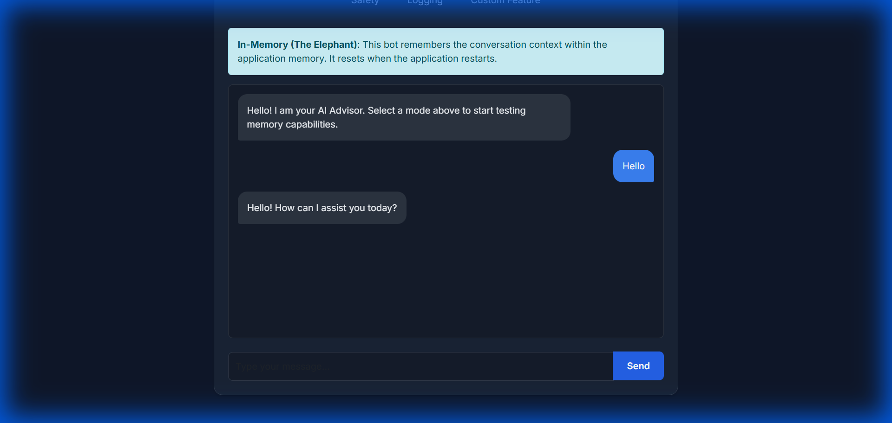
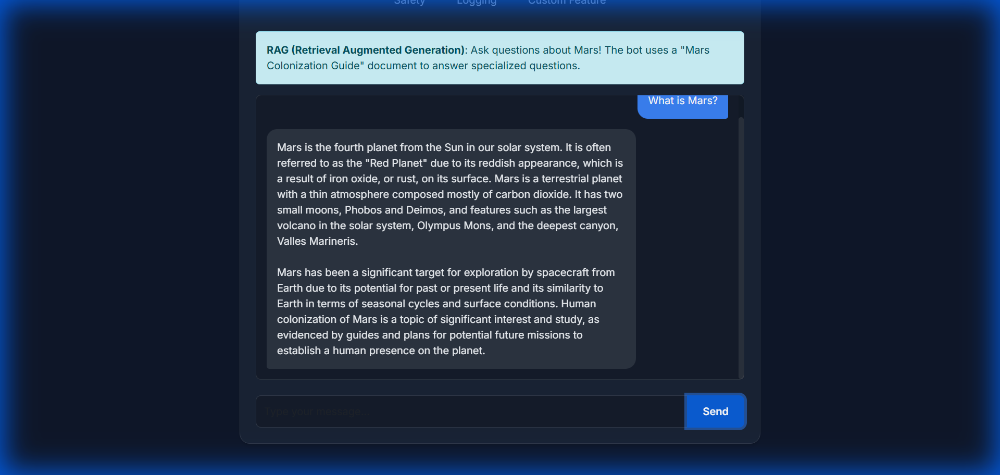
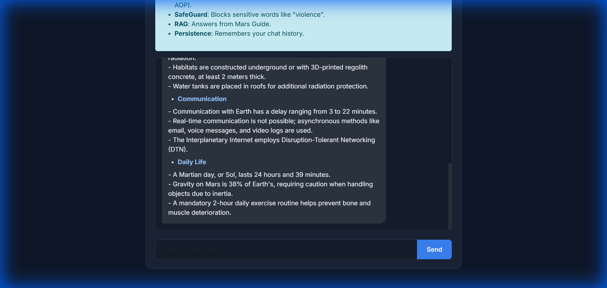

# Spring AI Advisor Application

This project demonstrates various Spring AI features through a two-part tutorial series:

---

## Part 1: Spring AI Advisor Basics

Learn the fundamentals of Spring AI Advisors including memory management, RAG, and safety filters.

| # | Feature | Description |
|---|---|---|
| 1 | **In-Memory** | Conversation history stored in memory |
| 2 | **Multi-User** | Separate histories per `userId` header |
| 3 | **Persistent** | H2 database for history across restarts |
| 4 | **Sliding Window** | Keeps only recent N messages for cost optimization |
| 5 | **RAG** | Uses Mars Colonization Guide for Q&A |
| 6 | **Safety** | `SafeGuardAdvisor` filters harmful content |
| 7 | **Logging** | Custom logging of token usage and duration |
| 8 | **Custom Feature** | Combined RAG + Persistence + Logging + PromptEnhancer |

**Access at:** `http://localhost:8080/`

---

## Part 2: Customer Support Bot with Knowledge Base

A production-ready AI customer support bot built on Part 1 learnings.

### Features

| Feature | Description |
|---|---|
| 🤖 **AI Chat** | Intelligent responses using RAG on product documentation |
| 👤 **Customer Context** | Personalized responses based on customer profile & plan |
| 📊 **Sentiment Analysis** | Detects frustrated customers for priority handling |
| 🎫 **Auto-Escalation** | Creates tickets when customers request human support |
| 🛡️ **Safety Filters** | Blocks inappropriate content and competitor mentions |
| 📝 **Professional Formatting** | Markdown responses with helpful resources |
| 💾 **Persistent Memory** | Conversation history survives restarts |

### Package Structure (Production Standard)

```
src/main/java/com/example/advisor/supportbot/
├── config/           # Configuration classes
├── controller/       # REST & Web controllers
├── service/          # Business logic layer
├── advisor/          # Custom AI advisors
├── model/
│   ├── entity/       # JPA entities
│   ├── dto/          # Data transfer objects
│   └── enums/        # Enumerations
├── repository/       # Data access layer
└── exception/        # Custom exceptions
```

### Custom Advisors

1. **SupportSafetyAdvisor** - Filters blocked content and abusive language
2. **CustomerContextAdvisor** - Injects customer profile into prompts
3. **SentimentAnalysisAdvisor** - Detects customer mood (positive/neutral/frustrated/angry)
4. **TicketEscalationAdvisor** - Auto-creates tickets for escalation requests
5. **ResponseFormattingAdvisor** - Adds branding and helpful resources

**Access at:** `http://localhost:8080/supportbot`

---

## Running the Application

```bash
# Set your OpenAI API key
export OPENAI_API_KEY=sk-...

# Run the application
mvn spring-boot:run
```

### URLs

| URL | Description |
|---|---|
| `http://localhost:8080/` | Part 1: Advisor Basics UI |
| `http://localhost:8080/supportbot` | Part 2: Support Bot UI |
| `http://localhost:8080/h2-console` | H2 Database Console |

---

## API Endpoints

### Part 1: Basics

| Endpoint | Description |
|---|---|
| `/advisor/chat/memory` | In-Memory Bot |
| `/advisor/chat/user` | Multi-User Bot |
| `/advisor/chat/persistent` | Persistent Memory Bot |
| `/advisor/chat/window` | Sliding Window Bot |
| `/advisor/chat/rag` | RAG Bot (Mars Guide) |
| `/advisor/chat/safety` | Safety Advisor Bot |
| `/advisor/chat/logging` | Logging Advisor Bot |
| `/advisor/chat/custom-feature` | Combined Feature Bot |

### Part 2: Support Bot

| Endpoint | Method | Description |
|---|---|---|
| `/support/chat` | POST | Send message, get AI response |
| `/support/chat` | GET | Simple chat (for testing) |
| `/support/chat/customer/{id}` | GET | Chat with customer context |
| `/support/tickets` | GET/POST | List/create tickets |
| `/support/tickets/{id}` | GET | Get ticket details |
| `/support/customers` | GET/POST | List/create customers |

---

## Screenshots

### Part 1: In-Memory Chat


### Part 1: RAG (Mars Guide)


### Part 1: Custom Feature (Advisor Chain)


---

## Tech Stack

- **Framework**: Spring Boot 3.5.9
- **AI**: Spring AI 1.1.2 with OpenAI GPT-4o
- **Database**: H2 (in-memory) with JPA
- **UI**: Thymeleaf + Modern CSS (Dark Theme)
- **Frontend**: Vanilla JavaScript with Marked.js

---

## License

This project is for educational purposes.
