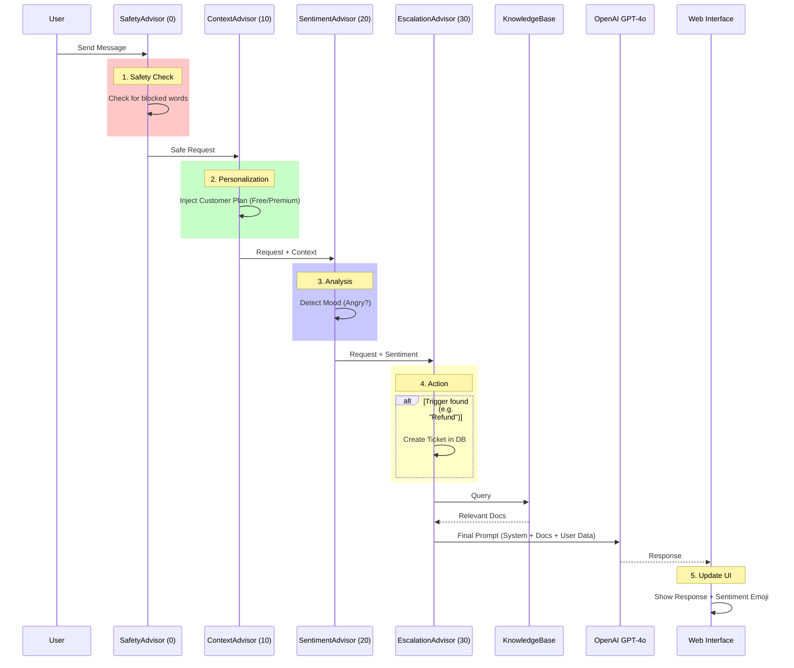

# 🎓 Building an Intelligent Customer Support Bot with Spring AI
> **A Comprehensive Code Walkthrough & Tutorial**

This document serves as a deep-dive tutorial for the **TaskFlow Support Bot** implementation. Unlike a standard README which tells you *how to run* the app, this guide explains *how it works* and *why it was built this way*.

We will dissect the application layer by layer, starting from the domain model up to the AI orchestration and UI.

---

## 🏗️ Architecture Overview

The bot functions as a **Retrieval-Augmented Generation (RAG)** system with an **Advisor Chain** architecture.

1.  **Request**: User sends a message.
2.  **Pre-Processing Advisors**:
    *   **Safety**: Blocks harmful inputs.
    *   **Context**: Fetches user profile (Free/Premium).
    *   **Sentiment**: Analyzes mood (Happy/Angry).
    *   **Escalation**: Checks if human help is needed.
3.  **Knowledge Retrieval (RAG)**: Finds relevant docs from `product_faq.txt`, etc.
4.  **LLM Call**: Sends enhanced prompt to GPT-4o.
5.  **Post-Processing Advisors**:
    *   **Formatting**: Logs and formats the response.
6.  **Response**: Sent back to user.

---

## 🚀 Phase 1: The Core Domain (Models)

Before any AI, we need a solid business domain. We use **JPA Entities** to model our data.

### 1. The Customer (`Customer.java`)
We need to know *who* we are talking to.
- **Why?** To personalize the experience. A VIP user gets different answers than a free user.
- **Key Fields**:
    - `CustomerPlan`: Enum (`FREE`, `PREMIUM`, `ENTERPRISE`).
    - `companyName`: Used for B2B context.

### 2. The Ticket (`Ticket.java`)
When the AI can't help, we need a fallback.
- **Why?** To bridge the gap between AI and human support.
- **Key Fields**:
    - `Sentiment`: We store the user's mood when the ticket was created!
    - `Priority`: `CRITICAL` if legal/billing issues, `MEDIUM` for others.

---

## 🧠 Phase 2: The Brain (Custom Advisors)

This is the most powerful part of Spring AI. Advisors are like *middleware* or *interceptors* for### High-Level Flow


### 🛡️ 1. Safety Advisor (`SupportSafetyAdvisor.java`)
**Goal:** Prevent liability and abuse.
- **Mechanism:** Implements `CallAdvisor`.
- **Logic:**
    1.  Intercepts `ChatClientRequest`.
    2.  Check user input against `BLOCKED_WORDS` list.
    3.  **Crucial Step:** If blocked, it returns a `ChatClientResponse` *immediately* without ever calling OpenAI. This saves money and ensures safety.

### 👤 2. Customer Context Advisor (`CustomerContextAdvisor.java`)
**Goal:** The "Memory" of who the user is.
- **Logic:**
    1.  Uses `CustomerRepository` to find the user.
    2.  Constructs a "System Prompt" extension:
        > "You are speaking with John (PREMIUM). He works at Acme Corp."
    3.  **Prompt Engineering**: We explicitly tell the LLM: *"As a Premium customer, mention dedicated support options."*

### 🔮 3. Sentiment Advisor (`SentimentAnalysisAdvisor.java`)
**Goal:** Emotional Intelligence.
- **Logic:**
    1.  Analyzes input for keywords (e.g., "furious", "hate" -> `ANGRY`).
    2.  Stores this state in `lastDetectedSentiment`.
    3.  This state is later used by the UI to show an emoji (😤) and by the Ticket system to set priority.

### 🎫 4. Escalation Advisor (`TicketEscalationAdvisor.java`)
**Goal:** Action-Oriented AI.
- **Logic:**
    1.  Looks for triggers: "manager", "refund", "human".
    2.  **Side Effect**: If triggered, it actually calls `ticketRepository.save()` *before* the LLM even answers.
    3.  The LLM is then told (via prompt context or just responding naturally) that a ticket was created.

---

## 📚 Phase 3: Knowledge Base (RAG)

The bot needs to know about *our* product (TaskFlow), not just general world knowledge.

### 1. The Documents (`src/main/resources/supportbot-docs/`)
We use plain text files for simplicity:
- `billing_policy.txt`: "Refunds allowed within 14 days."
- `troubleshooting.txt`: "Clear cache if app allows."

### 2. The Vector Store (`VectorStoreConfiguration.java`)
**Goal:** Semantic Search.
- **Process:**
    1.  **Loading**: `TextReader` reads the `.txt` files.
    2.  **Splitting**: `TokenTextSplitter` breaks them into small chunks (e.g., paragraphs).
    3.  **Embedding**: OpenAI converts chunks into number arrays (vectors).
    4.  **Storage**: `SimpleVectorStore` (in-memory) stores them.

### 3. The Retrieval (`KnowledgeBaseService.java`)
**Goal:** Find the right answer.
- **Logic:**
    1.  User asks "How do I get a refund?"
    2.  `vectorStore.similaritySearch()` finds the chunk from `billing_policy.txt`.
    3.  We categorize the query (Billing vs Technical) to help the AI frame the answer.

---

## ⚙️ Phase 4: Service Orchestration

`SupportBotService.java` is the conductor of this orchestra.

```java
public ChatResponse chat(ChatRequest request) {
    // 1. RAG: Get context
    String context = knowledgeBaseService.getContextForQuery(request.message());

    // 2. Build Prompt
    String systemPrompt = BASE_PROMPT + "\n\nContext:\n" + context;

    // 3. Call AI with Advisors
    return chatClient.prompt()
        .system(systemPrompt)
        .user(request.message())
        .advisors(safety, context, sentiment, escalation, memory) // The Chain 🔗
        .call();
}
```

**Key Takeaway**: The Service layer doesn't know *how* sentiment works. It just ensures the `SentimentAdvisor` is in the chain. This is **Decoupled Design**.

---

## 💾 Phase 5: Persistent Memory

We don't want the bot to forget us when the server restarts.

### JDBC Chat Memory
- **Config**: `SupportBotConfiguration.java`
- **Component**: `JdbcChatMemoryRepository` (Spring AI provided).
- **Schema**: It automatically creates tables (`vector_store` tables internally if using vector DB, but here specifically for chat history).
- **Optimization**: We wrap it in `MessageWindowChatMemory(20)` to ensure we don't send 5,000 messages to OpenAI (cost/context limit).

---

## 🖥️ Phase 6: The Premium UI

We built a backend-driven frontend using **Thymeleaf** + **Vanilla JS**.

### 1. Server-Side Rendering (`supportbot.html`)
- Thymeleaf renders the initial "skeleton" and the list of customers.
- why? Fast initial load and easy SEO (if it were public).

### 2. Client-Side Interactivity (`supportbot.js`)
- **Chat**: Uses `fetch()` to POST messages to `/support/chat`.
- **Markdown**: Uses `marked.js` to turn AI's `**bold**` into `<b>bold</b>`.
- **Dynamic Updates**:
    - When `ticketCreated` is true in the JSON response, we call `loadTickets()` without refreshing the page.
    - Updates the Sentiment Emoji 😐/😤 in real-time based on the response metadata.

---

## 🛠️ How to Extend This

Now that you understand the pieces, here is how you can build on it:

1.  **Add PDF Support**: Change `TextReader` to `PagePdfDocumentReader` in `VectorStoreConfiguration` to read PDF manuals.
2.  **Real Database**: Switch `H2` to `PostgreSQL` in `application.properties` for production persistence.
3.  **New Advisor**: Create `SpamFilterAdvisor` to block repeated messages.
4.  **Voice**: Add a frontend microphone button using Web Speech API, sending text to backend.

---
*Created for the Spring AI Advisor Tutorial Series.*
