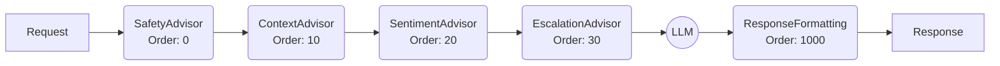

# 🔗 Spring AI Advisor Pattern (Chain of Responsibility)

This package contains the **Advisor Chain** implementation for the Support Bot. 

## 🎓 Learning Concept: Middleware for LLMs

In Spring AI, an **Advisor** is similar to a Servlet Filter or an Aspect in AOP. It intercepts the request *before* it reaches the LLM, and intercepts the response *after* it comes back.

### The Chain Flow

The advisors execute in a specific order defined by `getOrder()`.

### Components

| Class | Pattern | Purpose |
|-------|---------|---------|
| `SupportSafetyAdvisor` | **Short-Circuit** | Blocks execution immediately if content is unsafe. |
| `CustomerContextAdvisor` | **Prompt Injection** | Fetches data from DB and adds it to the System Prompt. |
| `SentimentAnalysisAdvisor` | **Stateful Analysis** | Analyzes the input and stores metadata for the UI. |
| `TicketEscalationAdvisor` | **Side Effect** | Triggers an external action (DB Save) based on logic. |
| `ResponseFormattingAdvisor` | **Post-Processing** | Observes the final output for logging/metrics. |

---
*Check the Javadoc in each file for detailed "How-To" implementation notes.*
